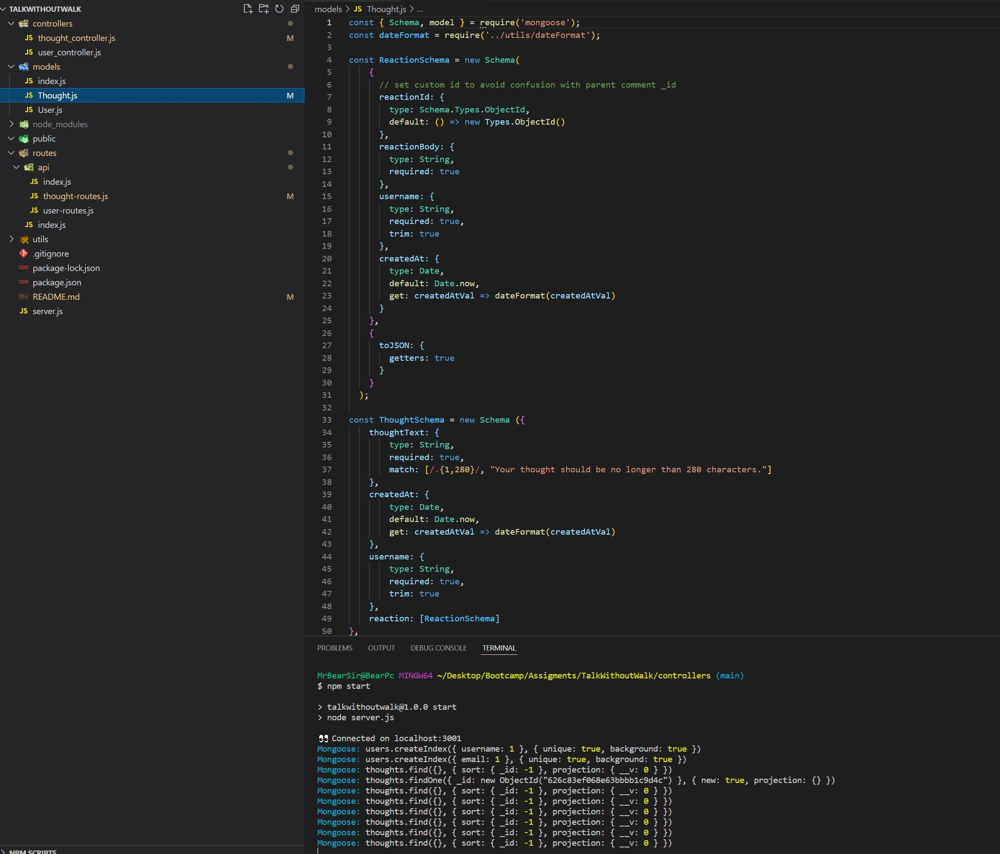

<h># TalkWithoutWalk (Social Network API)</h>
# Student Id.
# Oleg Dobrovolskyi

# Repository Link
https://github.com/MrBearSir/TalkWithoutWalk.git

# Deployed Video Showing Functionality
Starting Server - https://youtu.be/uscLH3211b0,
Testing User Routes - https://youtu.be/nEUOwJ0mSrc,
Testing Thoughts Routes - https://youtu.be/8928kmNDmMw

# Project type.
NoSQL Challenge

# User Story.
AS A social media startup
I WANT an API for my social network that uses a NoSQL database
SO THAT my website can handle large amounts of unstructured data

# Skills used in development.
<ul>
<li>App is built on MongoDb Data Base with Mongoose ODM.</li>
<li>Express and Mongoos packages.</li>
<li>Native JS date object for time stamp. </li>
<li>VS Code used as source code editor. </li>
<li>Thunder Client used as extention for VS code to alternate the Insomnia for API calls and UI for responses.</li>
</ul>